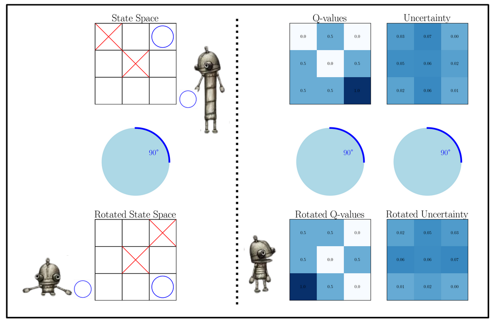

# On Uncertainty Calibration for Equivariant Functions

This repository contains all code for [On Uncertainty Calibration for Equivariant Functions](https://arxiv.org/abs/2510.21691) by [Edward Berman](https://ebrmn.space/), [Jacob Ginesin](https://jakegines.in/), [Marco Pacini](https://marco-pacini.github.io/), and [Robin Walters](https://www.robinwalters.com/). 



Blog post [here](https://edwardberman.github.io/EquiUQ/)

# Running Experiments

First, clone the repo (and the submodules!) via `git clone --recurse-submodules https://github.com/EdwardBerman/EquivariantUQBounds.git`

## Vector Field Regression

Refer to the README.md in the folder for the experiment

## Swiss Roll

Instructions are in the `ext_theory` Git submodule on how to run the "spiral" experiment

## Galaxy Morphology

Instructions are in the `SIDDA` Git submodule on how to run, including a script for producing the noised version of the dataset and a zenodo link to the default .npy files

## Chemical Scalar Properties

Run the `run.py` script in `/uq_bleading/`

## Chemical Vector Properties

See the SEGNN submodule. Specific training scripts will be added upon completion of a follow-up work.

# Citation

```
@misc{berman2025uncertaintycalibrationequivariantfunctions,
      title={On Uncertainty Calibration for Equivariant Functions}, 
      author={Edward Berman and Jacob Ginesin and Marco Pacini and Robin Walters},
      year={2025},
      eprint={2510.21691},
      archivePrefix={arXiv},
      primaryClass={cs.LG},
      url={https://arxiv.org/abs/2510.21691}, 
}
```
